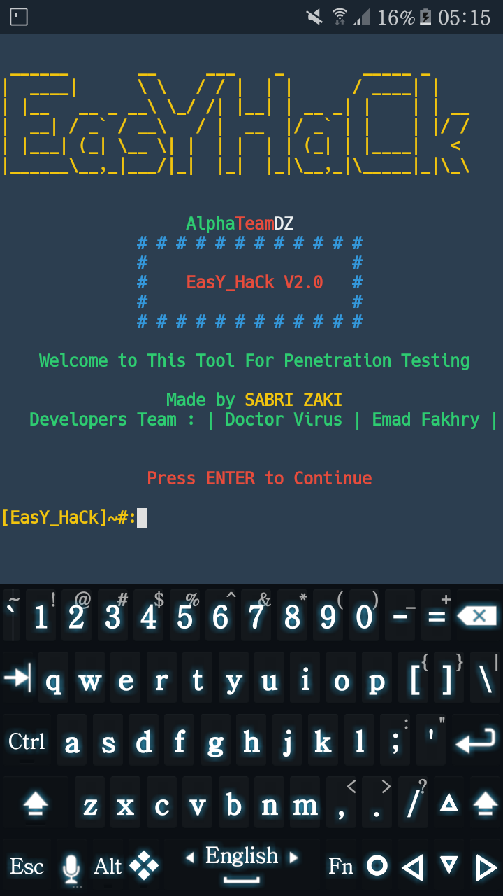

## EasY_HaCk
Hack the World using Termux
this tool is a developed by sabri.zaki for penetration testing using 
metasploit-framework 
sqlmap 
nmap 
metagoofil 
RED HAWK 
recon-ng and much more powerful testing tools
EasY_HaCk is a tool for network scanning and information gathering 
and for exploiting android phones and Windows pcs 
all that on Termux
## Installion
`pkg update`
`pkg upgrade`
`pkg install git`
'gig clone https://github.com/sabri-zaki/EasY_HaCk'
chmod +x install.sh
EasY-HaCk

